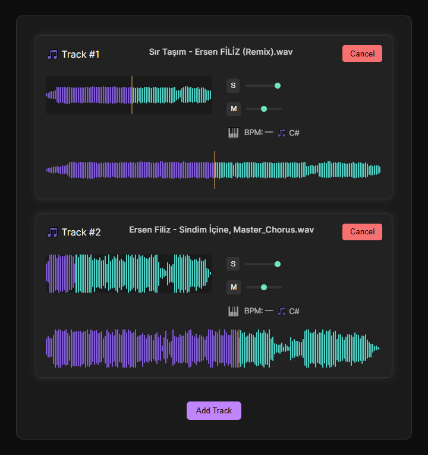

# 🎶 EzgiWave · Multi-Track Audio Assistant (Alpha)

EzgiWave is a cross-platform DAW companion app for real-time audio slot control. Designed to help audio creators visualize and manage individual sound layers with volume, pan, mute/solo, waveform preview and analysis.



---

## ✨ Features

| Feature             | Description                                                       |
| ------------------- | ----------------------------------------------------------------- |
| 🎛️ Track Controls   | Volume, Pan, Mute, Solo – per slot                                |
| 📈 Waveform Viewer  | Instant waveform preview on audio load                            |
| 🎚️ Global Controls  | Play / Pause / Rewind all tracks (coming soon)                    |
| 📦 File-Based Slots | Add audio files into slots with real-time waveform rendering      |
| 🎧 Detection Ready  | Instrument, BPM, Note placeholders (detection engine coming soon) |
| ⚡ Fast & Compact   | Designed for simplicity and speed with modular slot layout        |
| 🌍 i18n Ready       | English / Turkish localization supported                          |

---

## 🚀 Getting Started

```bash
git clone https://github.com/saygiylasunar/EzgiWave.git
cd EzgiWave
npm install
npm run dev
```

🛠 Tech Stack
React + Vite

SCSS with design tokens

Web Audio API (planned)

Custom waveform rendering

Multi-language i18n

📌 Roadmap
Audio slot system with mute/solo/volume

Waveform preview component

Playback engine with precise sync

BPM & note detection module

Track drag-reorder and group controls

🤝 Contributing
Pull requests are welcome. Let’s shape the future of audio tooling together!

🧠 License
MIT © saygiylasunar

---

```markdown
# 🎶 EzgiWave · Çok Kanallı Ses Asistanı (Alpha)

EzgiWave, ses prodüksiyon sürecinizde size yardımcı olmak için geliştirilmiş, çok kanallı slot yönetimi sunan bir DAW yardımcı aracıdır. Gerçek zamanlı dalga formu önizlemesi, her bir ses kanalı için ayrı kontrol imkanı ve yakında gelecek analiz özellikleriyle birlikte modern ve kullanıcı dostu bir tasarım sunar.
```
