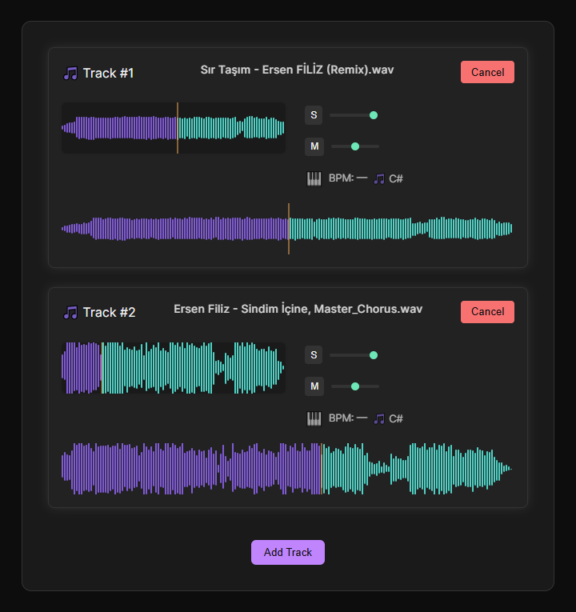

# 🎶 EzgiWave · Multi-Track Audio Assistant (Alpha)

EzgiWave is a cross-platform DAW companion for lightweight multi-track control, waveform inspection and future audio analysis.



## ✨ Current scope

| Feature | Status |
| --- | --- |
| Per-track volume / pan / mute / solo | Alpha |
| Waveform preview | Alpha |
| File-based slots | Alpha |
| Global playback controls | Planned |
| BPM / note / instrument analysis | Planned |
| Track reordering / grouping | Planned |
| English / Turkish i18n | In progress |

## 🚀 Getting started

```bash
git clone https://github.com/saygiylasunar/EzgiWave.git
cd EzgiWave
npm install
npm run dev
```

## 🛠 Tech stack

- React + Vite
- SCSS design tokens
- custom waveform rendering
- Web Audio API integration path
- bilingual i18n structure

## Alpha priorities

EzgiWave should stay useful before becoming a full DAW. The immediate order is:

1. deterministic slot loading and track state
2. synchronized playback transport
3. stable waveform rendering
4. drag/reorder and grouping
5. analysis modules such as BPM, note and instrument hints

Analysis features should remain optional so they do not block the basic editing/control workflow.

## Design principle

> Small companion, not another DAW.

The interface should make common track operations faster without duplicating the complexity of a full production suite.

## 🤝 Contributing

Pull requests are welcome. Keep changes modular and avoid coupling playback, waveform rendering and future analysis engines unnecessarily.

## 🧠 License

MIT © saygiylasunar

---

## Türkçe

EzgiWave; çok kanallı ses dosyalarını slot mantığıyla yönetmek, dalga formlarını hızlıca görmek ve ileride BPM / nota / enstrüman analizi eklemek için geliştirilen hafif bir DAW yardımcı aracıdır.

Temel hedef, tam teşekküllü bir DAW olmak yerine mevcut prodüksiyon akışını hızlandıran küçük ve modüler bir araç olarak kalmaktır.
